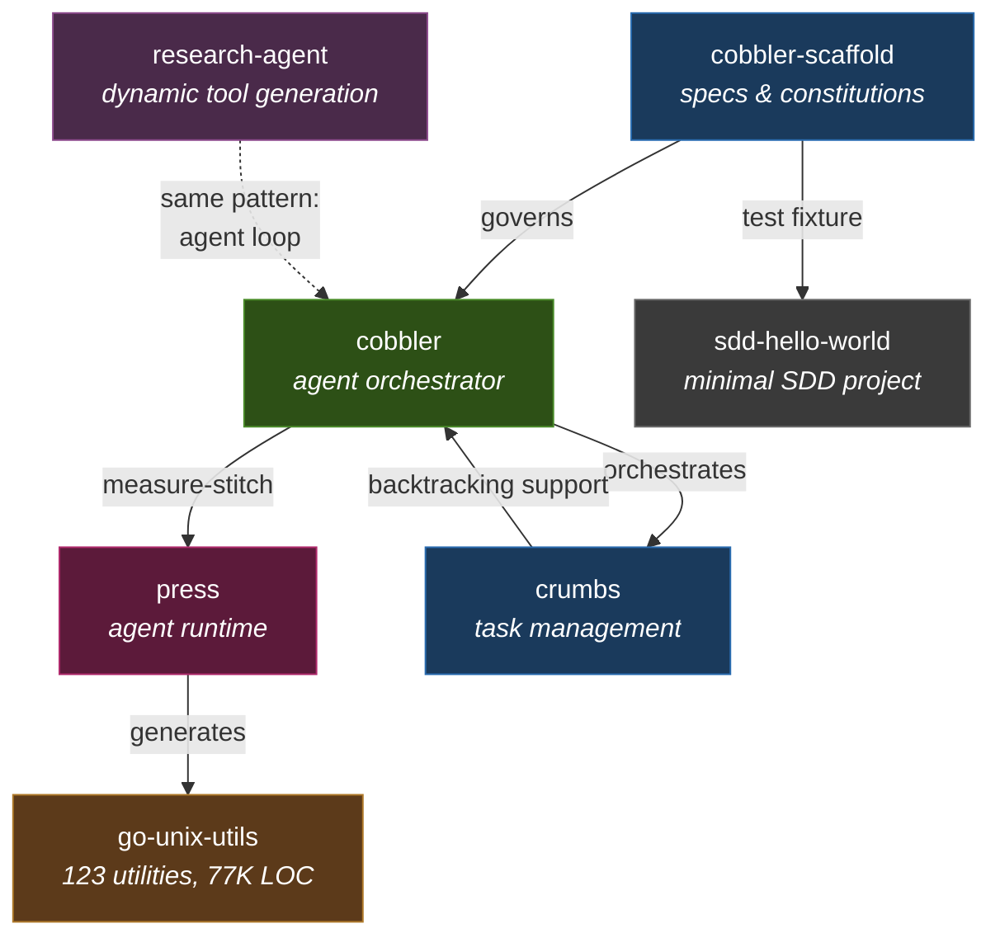

# Petar Djukic

Principal AI Architect. 20+ years building production systems. PhD in Computer Engineering. 69 US patents.

I design agentic systems that hold up in production — the part that comes after the demo.

**[declarative-agents](https://github.com/Nokia-Bell-Labs/declarative-agents)** — I designed and built this agent framework; **Nokia Bell Labs open-sourced it.** Agents are verifiable state machines: states, signals, and transitions declared in YAML and checked before they run — no dead states, no unhandled signals. Every run is traced end-to-end with OpenTelemetry and can be rolled back. Tools are declared the same way: typed inputs, outputs, side effects, and an undo. Written in Go — built for places where a free-running agent is not acceptable.

Independently, I build a spec-driven code-generation toolchain — coding agents make an ambitious project the work of one person.

## How the projects fit together

cobbler is a coding agent orchestrator. cobbler-scaffold provides the YAML specifications and constitutions that govern it. Together they implement a measure-stitch pipeline: the measure agent proposes work from specs, press executes it — invoking the LLM, running tools, and producing code. go-unix-utils is the primary output — 123 Unix utilities regenerated in Go and verified against GNU reference binaries via differential testing. crumbs provides task management with backtracking for the agent loops. research-agent applies the same agent-driven approach to research workflows, generating its own tools on demand rather than relying on pre-defined MCP registries.

The projects are at different stages of maturity:

| Stage | Description | Projects |
|-------|-------------|----------|
| **Fully automated** | End-to-end generation from spec via cobbler | go-unix-utils |
| **Spec complete** | Built manually, awaiting automated building | crumbs |
| **Spec draft** | Specifications in progress | press |

## Projects

**[cobbler](https://github.com/petar-djukic/cobbler)** — A coding agent orchestrator. Manages multi-agent workflows using the Anthropic API, coordinating Claude Code instances through structured agent loops. Handles context window budgeting, task routing, and session continuity across parallel execution.

**[cobbler-scaffold](https://github.com/petar-djukic/cobbler-scaffold)** — Specification constitutions and Mage orchestration for cobbler. YAML schemas govern Claude across design, planning, and execution phases. Implements measure-stitch: specs in, working code out.

**[press](https://github.com/petar-djukic/press)** — Agent runtime for specification-to-code generation. The execution engine inside a cobbler pipeline: takes a specification, invokes the LLM, runs tools, and produces code. The model proposes; the runtime decides what executes. Currently in specification phase.

**[go-unix-utils](https://github.com/petar-djukic/go-unix-utils)** — Go reimplementations of 123 Unix utilities (coreutils, moreutils, grep, findutils), generated from specification using cobbler. Each command is verified for functional parity against the GNU reference binary via differential testing. 77,000 lines of Go across 107 commands, all produced through the measure-stitch pipeline.

**[crumbs](https://github.com/petar-djukic/crumbs)** — A Go library for agent task management. Supports backtracking — agents can revisit and revise earlier decisions rather than treating task completion as one-directional. Built for use with LLM orchestration pipelines. Spec complete, built manually, awaiting automated rebuilding via cobbler.

**[research-agent](https://github.com/petar-djukic/research-agent)** — An end-to-end research workflow backed by a structured knowledge base. Claude generates tools, skills, and retrieval context on demand as research questions arise — rather than pre-defining them via MCP. An active experiment in whether dynamic tool generation makes static tool registries obsolete.

**[sdd-hello-world](https://github.com/petar-djukic/sdd-hello-world)** — Minimal spec-driven development test fixture for cobbler-scaffold. A toy project that exercises the full measure-stitch pipeline end-to-end without the complexity of a real codebase.

**[mcp-calc](https://github.com/petar-djukic/mcp-calc)** — A production-grade Model Context Protocol server and agent. 8,000 lines of Go, fully tested. Generated entirely from specification using a manual orchestrator (L3: human-scheduled tasks, agent-implemented). The methodology is described in [The Architecture-First Approach](https://meshintelligence.substack.com/p/the-architecture-first-approach).

## Writing

I write about production AI systems at [Mesh Intelligence](https://meshintelligence.substack.com).

- [The Architecture-First Approach](https://meshintelligence.substack.com/p/the-architecture-first-approach) — Spec-driven development with LLM orchestration: architect first, generate second
- [Dude, Where's My Code?](https://meshintelligence.substack.com/p/dude-wheres-my-code) — After 320,000 lines generated and deleted, specs are the source and code is the binary
- [What Level of Autonomy Is Your AI Development Workflow?](https://meshintelligence.substack.com/p/what-level-of-autonomy-is-your-ai) — A six-level taxonomy for agentic coding, from autocomplete to full autonomy
- [Three Commands to a Crude Orchestrator](https://meshintelligence.substack.com/p/three-commands-to-a-crude-orchestrator) — How three Claude skills compose into an agent loop that ships production code
- [What Does $33 of AI Code Generation Buy You?](https://meshintelligence.substack.com/p/what-does-33-of-ai-code-generation) — Cost breakdown of generating 4,586 lines of Go — context loading, not model intelligence, is where tokens go
- [Two Claude Skills and a Worktree Rule](https://meshintelligence.substack.com/p/two-claude-skills-and-a-worktree) — GitHub issues as single source of truth plus git worktrees for human review checkpoints
- [When the Agent Never Stops](https://meshintelligence.substack.com/p/when-the-agent-never-stops) — Agentic burnout is a planning problem, not a tooling problem
- [IT DOESN'T MATTER What Your Favourite Programming Language Is](https://meshintelligence.substack.com/p/it-doesnt-matter-what-your-favourite) — Choose languages based on what works with your AI tools, not personal preference
- [Your AI will be a Black Box Until You Add Logging](https://meshintelligence.substack.com/p/your-ai-will-be-a-black-box-until) — Production-grade logging of token usage and cache behavior is the actual fix for slow, costly AI
- [Running Multiple Claude Code Accounts with Containers](https://meshintelligence.substack.com/p/running-multiple-claude-code-accounts) — Running parallel Claude Code instances in Docker with clean credential boundaries

## Stack

Go · Python · Anthropic API · Claude Code · Model Context Protocol (MCP) · Docker · Linux
